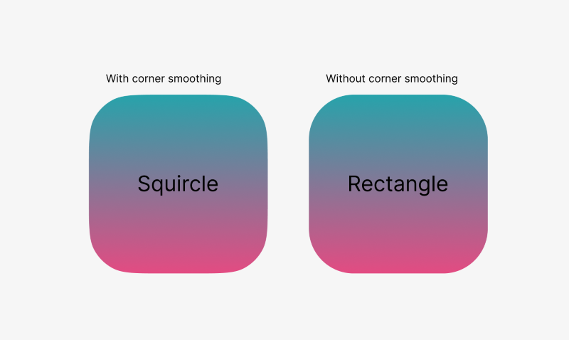
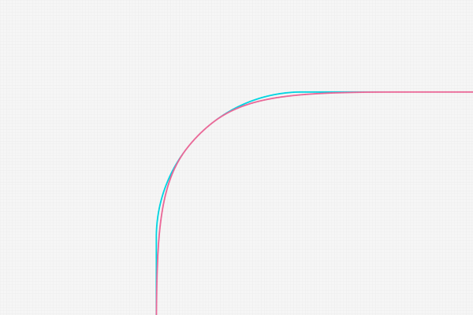

# Squircle Blazor Component

Squircle corner-smoothing blazor component like iOS border-radius.

[](https://www.nuget.org/packages/Squircle.Blazor/)



## What's Squircle

Figma has a great feature called corner smoothing, allowing you to create rounded shapes with a seamless continuous curve (squircles).

[https://help.figma.com/hc/en-us/articles/360050986854-Adjust-corner-radius-and-smoothing](https://help.figma.com/hc/en-us/articles/360050986854-Adjust-corner-radius-and-smoothing)

A squircle is a shape intermediate between a square and a circle. There are at least two definitions of "squircle" in use, the most common of which is based on the superellipse.
The word "squircle" is a portmanteau of the words "square" and "circle". 
Squircles have been applied in design and optics.


[https://en.wikipedia.org/wiki/Squircle](https://en.wikipedia.org/wiki/Squircle)

[https://medium.com/minimal-notes/rounded-corners-in-the-apple-ecosystem-1b3f45e18fcc](https://medium.com/minimal-notes/rounded-corners-in-the-apple-ecosystem-1b3f45e18fcc)



## DEMO
https://le-nn.github.io/blazor-squircle/


## Installation

You can install the package via NuGet.

```
dotnet add package Squircle.Blazor

```


## Usage

```html

<SquircleElement Radius="50" Roundness="0.2f" Style="width:200px;height:200px;background:red;">
    <div> Content </div>
</SquircleElement>

```

It also accept any div property and passes it to the holder.

```cs
/// <summary>
/// Gets or sets the CSS class for the SquircleElement component.
/// </summary>
[Parameter]
public string? Class { get; set; }

/// <summary>
/// Gets or sets the inline style for the SquircleElement component.
/// </summary>
[Parameter]
public string? Style { get; set; }

/// <summary>
/// Gets or sets the radius of the SquircleElement.
/// </summary>
[Parameter]
public float? Radius { get; set; }

/// <summary>
/// Gets or sets the roundness of the SquircleElement.
/// Recommended to set range 0 - 0.4.
/// The default value is the ratio of iOS default.
/// </summary>
[Parameter]
public float? Roundness { get; set; } = _defaultRoundness;

/// <summary>
/// Gets or sets the child content of the SquircleElement.
/// </summary>
[Parameter]
public RenderFragment? ChildContent { get; set; }
```

Note: box-shadow will not be visible because under the hood squircle is based on css masks.
Please consider using filter drop-shadow.

```html

<div style="filter: drop-shadow(4px 4px 4px rgba(0, 0, 0, 0.3));">
    <SquircleElement Radius="50" Roundness="0.2f" Style="width:200px;height:200px;background:red;">
        <div> Content </div>
    </SquircleElement>
</div>

```

### Sample

[https://github.com/le-nn/blazor-squircle/tree/main/demo/Squircle.Blazor.Demo](https://github.com/le-nn/blazor-squircle/tree/main/demo/Squircle.Blazor.Demo)

